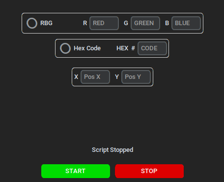

## Super Human Reaction

Test the limits on the website [Human Benchmark](https://humanbenchmark.com) reaction test with the automation on this app. I got this ideia out of an youtube video.

[Source](https://www.youtube.com/watch?v=HCQGhsHO1nM)

### 📦 Installing

To begin installing jump to releases and download the .zip file, open it up and execute main.exe

### ❓How does it work?

Once you execute the app a window like this will open

After that, select one option between **RGB** and **HEX** code to determine the color you want the program to react to.

The rules for the color selectors are:
- For RGB, the values go from 0 to 255, 0 being no color and 255 the maximum level of color possible.

    **Example: R = 200 G = 50 B = 100**

- For HEX, the value has 6 digits, ranging from 0 to F (0 to 9 and A to F, capital or lowercase doesn't matter) and the order of the digits is the same as RGB.

    **Example: The Hex code #AA3Fcc**

    On this example the "AA" corresponds to the red component, "3F" the green and lastly "cc" to the blue component.

Once the colors are decided, we choose a position on screen, a x and y position, where the reaction clicker will click.

When all of the **requirements** are met press the Start Button and the script will start. If you wish to stop it just press the Stop Button.

### ⚠️ Disclaimer 
This project is **not** meant to be used to get any unfair advantage. It's purely for:

- Educational purposes
- Testing the limits of automation
- Personal Experimentation

### To Implement

- Create a method for the user to left click a position on screen and make that the coordinates of the clicker.